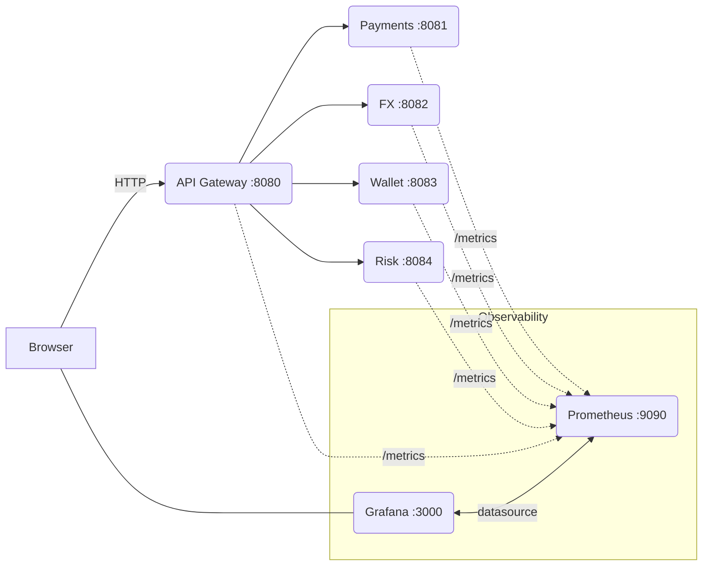

Siap! Ini versi README yang sudah “dipercantik” — rapi, enak dibaca, dan tetap praktis buat dipakai sehari-hari. Tinggal copas ke `README.md` kamu 👇

---

# Real-Time Multi-Currency Payment Gateway (PoC) ⚡💸

Monorepo **Proof of Concept** untuk *real-time multi-currency payment gateway* berbasis **microservices** (API Gateway, Payments, FX, Wallet, Risk) dengan **HTTP/JSON**, *observability* (**Prometheus + Grafana**), serta *tooling* untuk dummy data & testing.

> ⚠️ **Catatan:** Ini PoC untuk edukasi/demonstrasi. **Bukan** siap produksi (belum ada persistence DB, auth lengkap, HA, dsb.).

<p align="left">
  
  
  
  
</p>

---

## Daftar Isi

* [Arsitektur Singkat](#arsitektur-singkat)
* [Struktur Repo](#struktur-repo)
* [Prasyarat](#prasyarat)
* [Quick Start (Dev)](#quick-start-dev)
* [Smoke Test Cepat](#smoke-test-cepat)
* [Observability](#observability)
* [Dummy Data (CSV)](#dummy-data-csv)
* [Testing](#testing)
* [Makefile – Target Penting](#makefile--target-penting)
* [Endpoints](#endpoints)
* [Development Notes](#development-notes)
* [Troubleshooting](#troubleshooting)
* [Security & Production Gaps](#security--production-gaps)
* [Lisensi](#lisensi)

---

## Arsitektur Singkat

* **api-gateway**: *entrypoint* HTTP, melayani *static frontend* (embed Grafana) + health/metrics.
* **payments**: *mock* pembuatan transaksi pembayaran.
* **fx**: *mock* FX rate & conversion.
* **wallet**: *mock* informasi saldo.
* **risk**: *mock* skor risiko transaksi.
* **prometheus**: scrape metrics dari tiap service.
* **grafana**: dashboard metrik (auto-provision via file JSON).



---

## Struktur Repo

```
payment-gateway-poc/
├─ README.md
├─ Makefile
├─ go.mod / go.sum
│
├─ pkg/
│  ├─ metrics/                 # Prometheus metrics (Counter/Histogram)
│  ├─ proto/                   # *.proto (opsional, placeholder)
│  ├─ auth/ tracing/ errors/   # placeholder libs
│
├─ services/
│  ├─ api-gateway/
│  │  ├─ main.go
│  │  └─ static/index.html     # frontend minimal + embed Grafana
│  ├─ payments/main.go
│  ├─ fx/main.go
│  ├─ wallet/main.go
│  └─ risk/main.go
│
├─ tools/
│  └─ cmd/dummygen/main.go     # generator CSV dummy (-n)
│
├─ tests/
│  ├─ data/dummy_transactions.csv
│  ├─ e2e/payment_load.js
│  └─ e2e/payment_load_from_csv.js
│
├─ deployments/
│  ├─ docker/Dockerfile
│  └─ compose/docker-compose.dev.yaml
│
├─ grafana/
│  ├─ dashboards/payment.json  # grafana_payment_gateway_dashboard*.json
│  └─ provisioning/
│     ├─ dashboards/provider.yaml
│     └─ datasources/prometheus.yaml
│
└─ prometheus/prometheus.yml
```

---

## Prasyarat

* **Docker** & **Docker Compose v2**
* (Opsional) **Go** ≥ 1.22 bila ingin menjalankan `go` secara lokal.
  Tanpa Go lokal pun, semua build/test bisa dijalankan via Docker.

---

## Quick Start (Dev)

Jalankan seluruh stack:

```bash
make dev
# atau manual:
docker compose -f deployments/compose/docker-compose.dev.yaml up -d --build
```

Akses cepat:

* **Frontend (embed Grafana)** → [http://localhost:8080](http://localhost:8080)
* **Grafana** → [http://localhost:3000](http://localhost:3000) (anonymous viewer aktif; embedding diizinkan)
* **Prometheus** → [http://localhost:9090](http://localhost:9090)
* **Services**:

  * Payments → [http://localhost:8081](http://localhost:8081)
  * FX       → [http://localhost:8082](http://localhost:8082)
  * Wallet   → [http://localhost:8083](http://localhost:8083)
  * Risk     → [http://localhost:8084](http://localhost:8084)

Hentikan stack:

```bash
make down
```

Lihat log / status:

```bash
make logs
make ps
```

---

## Smoke Test Cepat

Health & metrics:

```bash
curl -s http://localhost:8080/healthz | jq
curl -s http://localhost:8080/metrics | head

curl -s http://localhost:8081/healthz | jq
curl -s http://localhost:8081/metrics | head
```

Fungsi *mock*:

```bash
# Payments
curl -s -X POST http://localhost:8081/payments \
  -H "Content-Type: application/json" \
  -d '{"id":"PAY-001","currency":"USD","amount":123.45,"source_account":"ACC_SRC_ABC","destination_account":"ACC_DST_DEF"}' | jq

# FX
curl -s "http://localhost:8082/rate?base=USD&quote=IDR" | jq
curl -s "http://localhost:8082/convert?from=USD&to=IDR&amount=1" | jq

# Wallet
curl -s http://localhost:8083/balance/ACC_001 | jq

# Risk
curl -s -X POST http://localhost:8084/score \
  -H "Content-Type: application/json" \
  -d '{"account":"ACC_001","amount":999.99,"currency":"USD"}' | jq
```

---

## Observability

* **Prometheus** → *Status → Targets* harus **UP**.
* **Grafana**:

  * Dashboard diprovision dari `grafana/dashboards/payment.json` (UID contoh: `paygw-poc`).
  * Contoh URL embed (di `services/api-gateway/static/index.html`):

    ```
    http://localhost:3000/d/paygw-poc?orgId=1&kiosk
    ```
  * Panel utama:

    * **Request rate** per service
    * **Error rate** (5m) per service
    * **p95/p99 latency** per service
    * **Requests in last 5m** per service
  * Contoh PromQL:

    ```promql
    sum by (service) (rate(payment_requests_total[1m]))
    100 * (sum by (service) (increase(payment_requests_total{status="FAILED"}[5m])) / sum by (service) (increase(payment_requests_total[5m])))
    histogram_quantile(0.95, sum by (service, le) (rate(payment_request_duration_seconds_bucket[5m])))
    histogram_quantile(0.99, sum by (service, le) (rate(payment_request_duration_seconds_bucket[5m])))
    ```

---

## Dummy Data (CSV)

Generator: `tools/cmd/dummygen` → output default `tests/data/dummy_transactions.csv`.

**Via Docker (tanpa Go lokal):**

```bash
make dummy-docker            # 100 baris (default)
make dummy-docker N=1000     # 1000 baris
```

Atau langsung:

```bash
docker run --rm -v "$(pwd)":/app -w /app \
  --entrypoint /usr/local/go/bin/go golang:1.22 \
  run ./tools/cmd/dummygen -n 1000
```

Verifikasi:

```bash
wc -l tests/data/dummy_transactions.csv
# 1001 (1 header + 1000 data)
```

---

## Testing

### End-to-End (k6)

Contoh **CSV load** (parametrik, aman untuk Docker):

```bash
# lewat network host (Docker Desktop/WSL)
docker run --rm -it \
  -v "$PWD:/work" -w /work grafana/k6 run \
  -e PAYMENTS=http://host.docker.internal:8081 \
  -e CSV_PATH=./tests/data/dummy_transactions.csv \
  tests/e2e/payment_load_from_csv.js
```

Atau **join network compose** (akses service via nama container):

```bash
docker run --rm -it \
  --network compose_default \
  -v "$PWD:/work" -w /work grafana/k6 run \
  -e PAYMENTS=http://payments:8081 \
  -e CSV_PATH=../data/dummy_transactions.csv \
  tests/e2e/payment_load_from_csv.js
```

### Integration test (Go)

```bash
make test-integration-docker     # Dockerized
# atau
make test                         # butuh Go lokal
```

---

## Makefile – Target Penting

| Target                         | Deskripsi                                |
| ------------------------------ | ---------------------------------------- |
| `make dev`                     | Up stack dev (Compose, build bila perlu) |
| `make down`                    | Stop & remove containers                 |
| `make logs`                    | Tail logs semua service                  |
| `make ps`                      | Status container                         |
| `make dummy-docker N=1000`     | Generate CSV dummy via Docker            |
| `make test-integration-docker` | Integration test (Dockerized)            |
| `make test-docker`             | Semua test (Dockerized)                  |
| `make test`                    | Semua test (Go lokal)                    |
| `make build`                   | Build semua paket                        |

---

## Endpoints

| Service     | Port | Healthz    | Metrics    | Catatan                         |
| ----------- | ---- | ---------- | ---------- | ------------------------------- |
| api-gateway | 8080 | `/healthz` | `/metrics` | serve `static/` + embed Grafana |
| payments    | 8081 | `/healthz` | `/metrics` | `POST /payments`                |
| fx          | 8082 | `/healthz` | `/metrics` | `/rate`, `/convert`             |
| wallet      | 8083 | `/healthz` | `/metrics` | `/balance/{id}`                 |
| risk        | 8084 | `/healthz` | `/metrics` | `POST /score`                   |
| prometheus  | 9090 | –          | –          | UI & query                      |
| grafana     | 3000 | –          | –          | Anonymous + embedding           |

---

## Development Notes

### Hot-reload static frontend

Aktifkan **bind-mount** agar ubah `index.html` langsung tersaji:

```yaml
# deployments/compose/docker-compose.dev.yaml (service api-gateway)
volumes:
  - ../../services/api-gateway/static:/app/static:ro
```

### Bila Go lokal belum terpasang

Jalankan perintah `go` via Docker:

```bash
docker run --rm -v "$(pwd)":/app -w /app \
  --entrypoint /usr/local/go/bin/go golang:1.22 <COMMAND>
# contoh:
# ... go test ./... -v
# ... go run ./tools/cmd/dummygen -n 1000
```

---

## Troubleshooting

* **Makefile: `missing separator`** → baris resep wajib **TAB**, bukan spasi.
* **`go: not found`** → pakai target Dockerized (`make test-docker`) atau install Go.
* **`illegal character U+0023 '#'` saat `go test ./...`** → pastikan `deployments/docker/Dockerfile` **bukan** `Dockerfile.go`.
* **Grafana iframe “Page not found”** → gunakan URL berbasis **UID** (mis. `paygw-poc`), pastikan provision & mount folder-to-folder.
* **Datasource duplicate default** → hanya **satu** `isDefault: true` di `grafana/provisioning/datasources/*.yaml`.
* **Grafana gagal start karena mount** → hindari file-to-file; pakai **folder-to-folder**:

  ```yaml
  - ../../grafana/dashboards:/var/lib/grafana/dashboards:ro
  - ../../grafana/provisioning:/etc/grafana/provisioning:ro
  ```
* **Error rate tinggi** → cek handler `payments` & variabel `FAIL_RATE`; error dihitung dari **HTTP status** di middleware. Set `FAIL_RATE=0.0` bila ingin nol.

---

## Security & Production Gaps

* Tidak ada DB/persistence.
* Auth/authorization dummy.
* Tidak ada rate limiting, circuit breaker, retry, tracing lengkap.
* TLS, secret management, dan hardening container belum disiapkan.

> Untuk produksi: siapkan penyimpanan transaksi, idempotency key, retry-safe queue, audit log, tracing E2E, *blue/green* deployment, dsb.

---

## Lisensi

Tentukan lisensi sesuai kebutuhan (MIT/Apache-2.0/dll).

---

*Selesai. Kalau mau, aku bisa bikinkan badge tambahan (coverage, CI), atau mini-screenshot Grafana untuk ditempel di README.*
