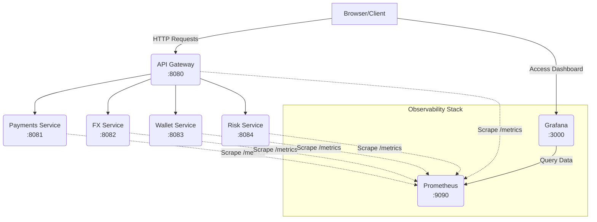
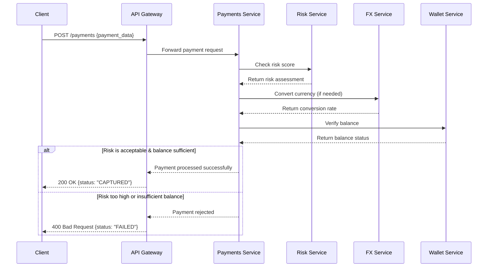

# Real-Time Multi-Currency Payment Gateway (PoC) ⚡💸

Monorepo **Proof of Concept** untuk _real-time multi-currency payment gateway_ berbasis **microservices** (API Gateway, Payments, FX, Wallet, Risk) dengan **HTTP/JSON**, _observability_ (Prometheus + Grafana), serta _tooling_ untuk dummy data dan testing.

> ⚠️ **Catatan**: Ini PoC untuk edukasi/demonstrasi. **Bukan** siap produksi (belum ada persistence DB, auth lengkap, HA, dsb.).

## 🎯 Masalah yang Dipecahkan

### 1. **Kompleksitas Sistem Payment Multi-Currency**
- Transaksi lintas mata uang membutuhkan **konversi real-time** dengan rate yang akurat
- Perlu handling **fluktuasi nilai tukar** yang dapat berubah cepat
- Validasi **ketersediaan saldo** dalam berbagai currency

### 2. **Risk Management yang Real-Time**
- Deteksi **transaksi mencurigakan** secara instan
- Penilaian **risk score** berdasarkan berbagai faktor
- Pencegahan **fraud** sebelum transaksi diproses

### 3. **Observability dan Monitoring**
- Kesulitan **melacak performance** sistem secara real-time
- Kurangnya **visibility** pada metrics penting (latency, error rate, throughput)
- **Troubleshooting** yang lambat ketika terjadi issues

### 4. **Testing dan Data Realistik**
- Kesulitan mendapatkan **data testing** yang menyerupai production
- **Load testing** dengan scenario yang realistic
- Validasi **end-to-end flow** tanpa environment production

## ⚡ Solusi yang Diterapkan

### 1. **Arsitektur Microservices**
```go
// Setiap service memiliki responsibility khusus
services/
├─ api-gateway/     // Entry point & routing
├─ payments/        // Processing transaksi
├─ fx/             // Currency conversion
├─ wallet/         // Balance management
├─ risk/           // Fraud detection
```

### 2. **Real-Time Currency Exchange**
```go
// FX service menangani konversi real-time
GET /rate?base=USD&quote=IDR
GET /convert?from=USD&to=IDR&amount=100
```

### 3. **Comprehensive Observability Stack**


### 4. **Data-Driven Testing Infrastructure**
```go
// Generator data dummy yang realistic
tools/cmd/dummygen -n 1000
// Output: PAY-000001,IDR,188.52,ACC_SRC_5081,ACC_DST_1228
```

### 5. **Sequence Diagram Payment Processing**


## 🏗️ Arsitektur Sistem

```
Browser/Client
    │
    ▼
API Gateway (8080) ────┐
    │                  │
    ├─ Static Content  │
    │  (Grafana Embed) │
    │                  │
    └─ API Routing ────┤
                       │
                       ▼
               [Microservices]
    ┌─────────────┼─────────────┐
    │             │             │
    ▼             ▼             ▼
Payments       FX Service    Wallet Service
(8081)         (8082)        (8083)
    │             │             │
    └─────────────┼─────────────┘
                  │
                  ▼
              Risk Service
                 (8084)
```

## 📊 Manfaat yang Diberikan

### 1. **Real-Time Visibility**
- Dashboard Grafana menunjukkan **metrics live**
- **Monitoring** performance setiap service
- **Alerting** potential issues

### 2. **Scalability**
- Setiap service dapat **di-scale independently**
- **Load balancing** yang mudah diimplementasikan
- **Resource allocation** yang optimal

### 3. **Development Velocity**
- **Testing** yang comprehensive dengan data realistic
- **Debugging** yang lebih mudah dengan observability
- **Deployment** yang terisolasi per service

## 🚀 Quick Start (Dev)

Jalankan seluruh stack:

```bash
make dev
```

Akses:

- **Frontend (embed Grafana)**: [http://localhost:8080](http://localhost:8080)
- **Grafana**: [http://localhost:3000](http://localhost:3000)
- **Prometheus**: [http://localhost:9090](http://localhost:9090)

## 🧪 Testing

### End-to-End (k6) dengan CSV

```bash
docker run --rm -it \
  -v "$PWD:/work" -w /work grafana/k6 run \
  -e PAYMENTS=http://host.docker.internal:8081 \
  -e CSV_PATH=./tests/data/dummy_transactions.csv \
  tests/e2e/payment_load_from_csv.js
```

### Integration test

```bash
make test-integration-docker
```

## 📋 Endpoints

| Service     | Port | Healthz    | Metrics    | Endpoint Utama        |
| ----------- | ---- | ---------- | ---------- | --------------------- |
| api-gateway | 8080 | `/healthz` | `/metrics` | Routing & static content |
| payments    | 8081 | `/healthz` | `/metrics` | `POST /payments`      |
| fx          | 8082 | `/healthz` | `/metrics` | `/rate`, `/convert`   |
| wallet      | 8083 | `/healthz` | `/metrics` | `/balance/{id}`       |
| risk        | 8084 | `/healthz` | `/metrics` | `POST /score`         |

## 🏗️ Struktur Repo

```
payment-gateway-poc/
├─ services/               # Microservices
├─ tests/                 # Test scripts & data
├─ deployments/           # Docker & compose files
├─ grafana/              # Dashboard & provisioning
├─ prometheus/           # Config Prometheus
└─ tools/                # Data generator
```

## 🚀 PoC sebagai Foundation

Meskipun ini masih **Proof of Concept**, architecture ini memberikan:

1. **Blueprint** untuk system production-ready
2. **Patterns** yang dapat di-extend (database, auth, etc.)
3. **Testing framework** yang comprehensive
4. **Observability foundation** yang solid

**Kesimpulan:** PoC ini memecahkan masalah kompleksitas payment system multi-currency dengan approach microservices yang observable, testable, dan scalable! 🎉
