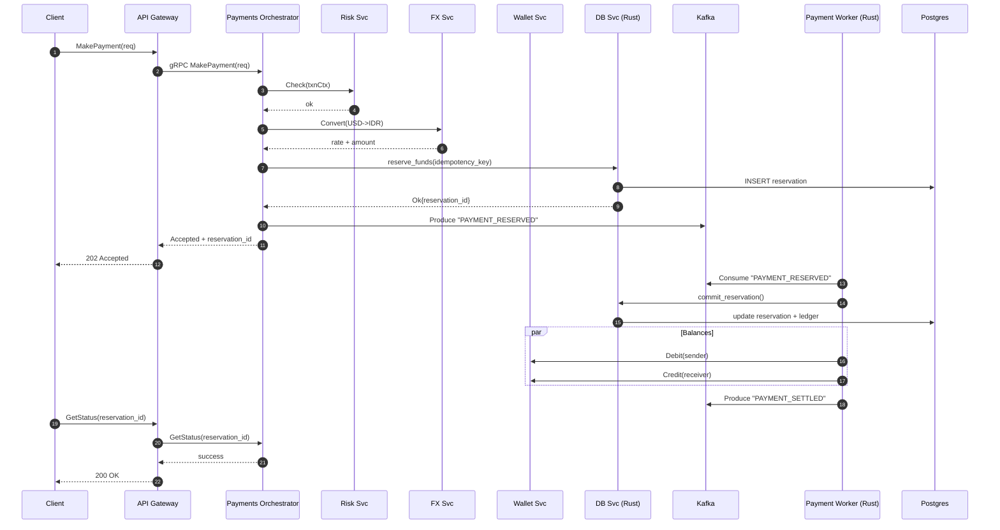

# Real-Time Multi-Currency Payment Gateway (PoC)

```
==============================================================================
Project : Real-Time Multi-Currency Payment Gateway (PoC)
Version : 0.1.0
Author  : Kukuh Tripamungkas Wicaksono (Kukuh TW)
Email   : kukuhtw@gmail.com
WhatsApp: https://wa.me/628129893706
LinkedIn: https://id.linkedin.com/in/kukuhtw
License : MIT (see LICENSE)

Summary : Monorepo Proof of Concept untuk real-time multi-currency payment
          gateway berbasis microservices (API Gateway, Payments, FX, Wallet,
          Risk) dengan gRPC, observability (Prometheus + Grafana), serta
          tooling untuk dummy data dan testing.
==============================================================================
```

---

## 📖 Ringkasan

Proyek ini adalah **Proof of Concept (PoC)** untuk sistem **pembayaran lintas mata uang real-time** berbasis **microservices**.
Menggunakan kombinasi:

* **Golang** → layanan domain (Wallet, FX, Risk, Payments, API Gateway)
* **Rust** → layanan berperforma tinggi (Database handler, Payment Worker)
* **gRPC** → komunikasi antar service
* **Postgres** → database utama
* **Kafka** → message broker untuk event-driven payment worker
* **Prometheus + Grafana** → observability metrics & dashboard

Tujuan: memberikan **arsitektur modular, scalable, resilient** yang dapat dijadikan blueprint untuk sistem pembayaran modern.

---

## ⚙️ Fitur Utama

* **gRPC Microservices** untuk domain Wallet, FX, Risk, Payments.
* **Multi-currency FX Service** dengan dummy kurs USD, IDR, SGD.
* **Idempotency**: menghindari double spend/reservasi ganda.
* **Risk Service**: rule engine sederhana untuk fraud detection.
* **Async Worker (Rust)**: settlement via Kafka.
* **Observability**: Prometheus + Grafana dashboard siap pakai.
* **Testing Tools**: e2e tests, load tests, dummy data generator.

---

## 🏗️ Arsitektur

flowchart LR;

%% Clients
C1[Web / Mobile Client]:::client
G[API Gateway (Go)\nHTTP + gRPC]:::gw

%% Go Services
subgraph GO[Go Services]
  W[Wallet Svc]:::svc
  FX[FX Svc]:::svc
  R[Risk Svc]()


## 🔄 Sequence Diagram: MakePayment Flow



---

## 📂 Struktur Direktori

Beberapa direktori penting:

* `cmd/` → entrypoint tiap service (wallet-grpc, payments-grpc, dll)
* `services/` → implementasi service (`api-gateway`, `db-rs`, `payments-rs`, dll)
* `proto/` → definisi protobuf
* `deployments/` → docker-compose, k8s manifest
* `grafana/` & `prometheus/` → observability setup
* `tests/` → e2e & load testing
* `tools/` → generator dummy data

---

## ⚙️ Setup Lingkungan

### Prasyarat

* Docker & Docker Compose
* Go 1.23+
* Rust (nightly, cargo, sqlx-cli)
* Protoc compiler
* Node.js (untuk e2e test)

### Jalankan Stack

```bash
# Clone repo
git clone https://github.com/your-org/realtime-payment-gateway.git
cd realtime-payment-gateway

# Generate dummy data
make gen-dummy

# Jalankan stack dengan Docker Compose
make dev-grpc

# Stop
make down-grpc
```

### Akses

Oke, kita tambahkan daftar **published ports** ke README agar jelas mapping service ↔ port. Saya sisipkan di bagian **Setup → Akses**, setelah penjelasan API Gateway, Prometheus, dan Grafana.

Berikut versi revisi:

---

## 🔌 Published Ports (Docker Compose)

Semua port yang dipublish saat menjalankan stack via `docker-compose`:

| Service           | Port(s)   | Keterangan          |
| ----------------- | --------- | ------------------- |
| Postgres          | **15432** | Database utama      |
| Kafka             | **9092**  | Message broker      |
| Kafka UI          | **9081**  | Web UI Kafka        |
| Kafka Exporter    | **9308**  | Metrics Kafka       |
| API Gateway       | **18080** | HTTP/REST + gRPC    |
| Wallet gRPC       | **19093** | gRPC service        |
| Wallet Metrics    | **19103** | Prometheus /metrics |
| FX gRPC           | **19102** | gRPC service        |
| Risk gRPC         | **19094** | gRPC service        |
| Risk Metrics      | **19104** | Prometheus /metrics |
| DB Service (Rust) | **19095** | gRPC service        |
| DB Metrics        | **19105** | Prometheus /metrics |
| Payments-RS       | **19096** | gRPC service        |
| Payments Metrics  | **19106** | Prometheus /metrics |
| Prometheus        | **19097** | Monitoring          |
| Grafana           | **3000**  | Dashboard           |

> Catatan: Gunakan mapping ini untuk mengakses service secara langsung (misalnya dengan `grpcurl`, `psql`, atau browser).

---

Mau saya buatkan juga contoh **command akses cepat**? (misal: `grpcurl -plaintext localhost:19093 list`, atau `psql -h localhost -p 15432 -U postgres poc`) supaya langsung bisa dicoba?


---

## 🔌 Endpoint gRPC

* **WalletService**: `GetBalance`, `Debit`, `Credit`
* **FXService**: `Convert(From, To, Amount)`
* **PaymentsService**: `MakePayment`, `GetStatus`
* **RiskService**: `Check(Transaction)`

---

## 📊 Monitoring

* Prometheus config → `prometheus/prometheus.yml`
* Grafana dashboard → `grafana/grafana_payment_gateway_dashboard.json`

---

## 🧪 Testing

### Start

```bash
./clean-start.sh
```


## 📌 Catatan

* Rust services dipakai untuk path kritikal performa tinggi.
* Go services dipakai untuk orchestrator & domain logic.
* PoC ini bisa jadi dasar implementasi production.

---

## 👨‍💻 Kontributor

* **Kukuh Tripamungkas Wicaksono (Kukuh TW)**

  * ✉️ Email: [kukuhtw@gmail.com](mailto:kukuhtw@gmail.com)
  * 💬 WhatsApp: [https://wa.me/628129893706](https://wa.me/628129893706)
  * 🔗 LinkedIn: [id.linkedin.com/in/kukuhtw](https://id.linkedin.com/in/kukuhtw)

---
