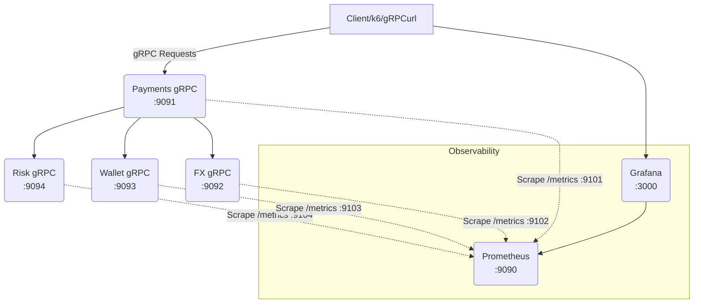
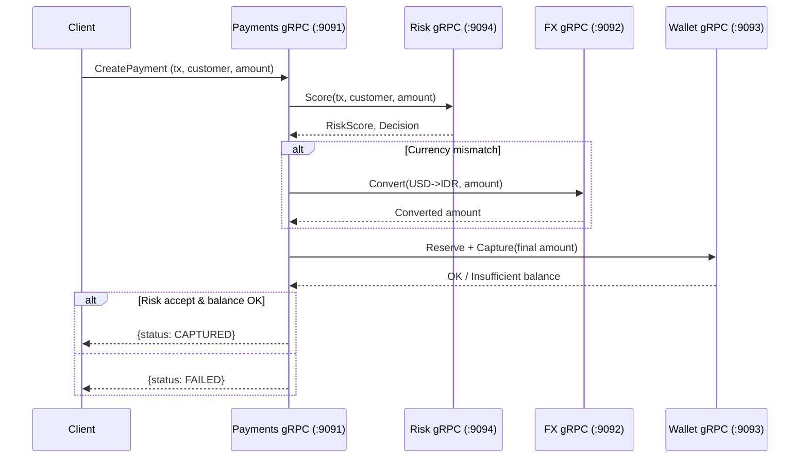

Baik, saya perbaiki README kamu supaya selaras dengan file struktur baru (`cmd/*-grpc`, `proto/`, `internal/grpcserver/`) dan arsitektur **gRPC** (menggantikan REST antar microservices). Berikut versi yang sudah diperbarui:

---

# Real-Time Multi-Currency Payment Gateway (PoC) ⚡💸

Monorepo **Proof of Concept** untuk *real-time multi-currency payment gateway* berbasis **microservices** (API Gateway, Payments, FX, Wallet, Risk) dengan **gRPC** sebagai komunikasi internal antar service, **Prometheus + Grafana** untuk observability, serta *tooling* untuk dummy data dan load testing.

> ⚠️ **Catatan**: Ini PoC untuk edukasi/demonstrasi. **Bukan** siap produksi (belum ada persistence DB, auth lengkap, HA, dsb.).

---

## 🎯 Masalah yang Dipecahkan

1. **Kompleksitas Payment Multi-Currency**

   * Konversi real-time antar currency
   * Handling fluktuasi nilai tukar
   * Validasi saldo lintas akun & mata uang

2. **Risk Management Real-Time**

   * Deteksi fraud instan
   * Risk scoring berbasis aturan & konteks transaksi
   * Pencegahan transaksi berisiko sebelum capture

3. **Observability**

   * Metrics latency, throughput, error rate per service
   * Dashboard real-time
   * Troubleshooting lebih cepat

4. **Testing & Data Realistik**

   * Generator dummy transaction
   * End-to-end load testing (REST & gRPC)
   * Validasi full payment flow tanpa env production

---

## ⚡ Solusi yang Diterapkan

### 1. **Arsitektur Microservices berbasis gRPC**

```bash
proto/                 # Kontrak .proto untuk Risk, Wallet, FX, Payments
internal/grpcserver/   # Implementasi server gRPC
cmd/                   # Main entrypoint per service
  ├─ risk-grpc/
  ├─ wallet-grpc/
  ├─ fx-grpc/
  └─ payments-grpc/
```

* **Komunikasi internal** antar service: gRPC (bukan lagi REST JSON)
* **Observability**: setiap service expose `/metrics` via HTTP tambahan untuk Prometheus

### 2. **gRPC Contracts (contoh)**

```proto
service PaymentsService {
  rpc CreatePayment(CreatePaymentRequest) returns (CreatePaymentResponse);
}

service RiskService {
  rpc Score(ScoreRequest) returns (ScoreResponse);
}
```

### 3. **Observability Stack**



### 4. **Data Dummy & Load Test**

```bash
# Generator data dummy
make dummy-docker N=1000

# Load test REST
make e2e-compose

# Load test gRPC
make e2e-grpc
```

### 5. **Sequence Diagram (gRPC Flow)**



---

## 🏗️ Arsitektur Sistem (High-Level)

```
Client (k6 / grpcurl)
    │
    ▼
Payments gRPC (9091)
 ├─ calls Risk gRPC (9094)
 ├─ calls FX gRPC (9092)
 └─ calls Wallet gRPC (9093)

[Observability]
 ├─ Prometheus (9090) scrape semua /metrics (910x)
 └─ Grafana (3000) visualisasi dashboard
```

---

## 📊 Manfaat

1. **Real-Time Visibility**

   * Metrics per RPC
   * Live dashboard

2. **Scalability**

   * Service dapat di-scale independen
   * Load balancing via gRPC

3. **Development Velocity**

   * Kontrak `.proto` → codegen otomatis
   * Dummy generator + load test gRPC

---

## 🚀 Quick Start

Jalankan stack (REST + gRPC + observability):

```bash
make dev
```

Jalankan hanya gRPC services:

```bash
make dev-grpc
```

Akses:

* **Grafana**: [http://localhost:3000](http://localhost:3000)
* **Prometheus**: [http://localhost:9090](http://localhost:9090)
* **gRPC services**:

  * Payments → `localhost:9091`
  * Wallet → `localhost:9093`
  * FX → `localhost:9092`
  * Risk → `localhost:9094`

---

## 🧪 Testing

### End-to-End (REST + CSV)

```bash
make e2e-csv-compose
```

### gRPC Load Test

```bash
make e2e-grpc \
  TX_ID=TXTEST CUSTOMER_ID=CUST-1 AMOUNT=250 VUS=10 DURATION=1m
```

---

## 📋 Ports & Endpoints

| Service       | gRPC Port | Metrics Port | gRPC Method Utama               |
| ------------- | --------- | ------------ | ------------------------------- |
| payments-grpc | 9091      | 9101         | `PaymentsService/CreatePayment` |
| wallet-grpc   | 9093      | 9103         | `WalletService/Reserve`         |
| fx-grpc       | 9092      | 9102         | `FxService/Convert`             |
| risk-grpc     | 9094      | 9104         | `RiskService/Score`             |
| api-gateway   | 8080      | 8080/metrics | (opsional: expose REST/gRPC-GW) |

---

## 🏗️ Struktur Repo

```
payment-gateway-poc/
├─ cmd/                   # Entrypoint service gRPC
│   ├─ payments-grpc/
│   ├─ wallet-grpc/
│   ├─ fx-grpc/
│   └─ risk-grpc/
├─ proto/                 # Protobuf definitions
│   ├─ common/v1/
│   ├─ payments/v1/
│   ├─ wallet/v1/
│   ├─ fx/v1/
│   └─ risk/v1/
├─ internal/
│   └─ grpcserver/        # Implementasi server gRPC
├─ deployments/
│   └─ compose/           # Docker compose files
├─ prometheus/            # Config Prometheus
├─ grafana/               # Dashboard provisioning
├─ tests/
│   └─ e2e/               # k6 & xk6-grpc scripts
└─ tools/
    └─ cmd/dummygen/      # Dummy data generator
```

---

## 🚀 PoC sebagai Foundation

Arsitektur ini memberikan:

1. **Blueprint** untuk production-ready payment gateway
2. **Kontrak gRPC** yang jelas & bisa di-extend (database, auth, dsb.)
3. **Testing framework** end-to-end REST + gRPC
4. **Observability** metrics per RPC

**Kesimpulan:** PoC ini membuktikan konsep payment gateway multi-currency real-time dengan komunikasi gRPC yang **observable, scalable, dan testable** 🎉

---

Mau saya bikinkan juga README tambahan **`README_GRPC.md`** khusus developer (isi instruksi build protos + jalankan server gRPC secara terpisah) biar repo kamu lebih mudah dipahami kontributor?
